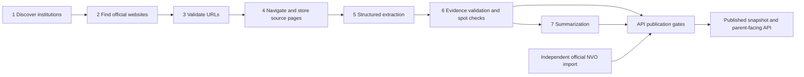

# Architecture and engineering decisions

The bilingual React interface calls a FastAPI API. Production serves a published PostgreSQL
snapshot; crawling and extraction run offline. See [README.md](README.md) for hosting and
[deploy/README.md](deploy/README.md) for release and recovery procedures.

## Data pipeline

Extraction uses Pydantic schemas and OpenAI/OpenRouter integrations. Stored source pages,
field provenance, confidence and validation issues support inspection. Published prices need
source URLs, confidence and page-evidence checks; an unstated period stays null. Spot checks
compare selected fields against a capable extractor. URL-validation failures withhold website
data until extraction and validation clear the marker. Pipeline runs and provider-request
records support cost attribution; pipeline configuration controls timeouts and budget limits.

Response allowlists and projection/gating utilities form the publication boundary. Raw
attributes, admission JSON, pricing context and source values remain internal. Successful
extraction alone does not make a field publishable. Summaries have withholding rules;
generated text is not evidence of school quality. Official NVO import is independent.

## Decisions and tradeoffs

- Country-specific education configuration supports multiple countries; Sofia is the initial
  dataset. NVO is a Bulgarian feature rather than a global grading assumption.
- Age groups use enrollment year minus birth year, reflecting calendar-year cohorts.
- Flexible school fields use SQLAlchemy JSON, not JSONB or a column per extracted field.
  Explicit projections keep flexible inputs out of the public API by default.
- Locations use latitude/longitude floats without PostGIS. GeoJSON comes first, with guarded
  Nominatim fallback; area centroids are not street-level evidence.
- One PostgreSQL API and a static frontend suit the city-scale workload. Redis/Celery support
  offline work rather than production browsing.
- Withholding uncertain values favors correctness over recall. Some comparisons therefore
  have sparse data rather than inferred prices or facilities.

## Ownership and current limits

This independently maintained project uses AI coding assistance. The maintainer owns
requirements, publication decisions, review and deployment. Tests, source evidence and
independent review provide verification; agent output alone is not acceptance evidence.

Large scraper/UI modules still need decomposition. Broader static typing and remaining
dependency advisories are follow-ups. Clean installations use the migration chain; historical
`create_all` installations require the additive alignment revision. Recovery changes images
or restores verified backups rather than relying on destructive schema downgrades. See
[the publication checklist](docs/PUBLICATION_CHECKLIST.md) for remaining operational controls.
